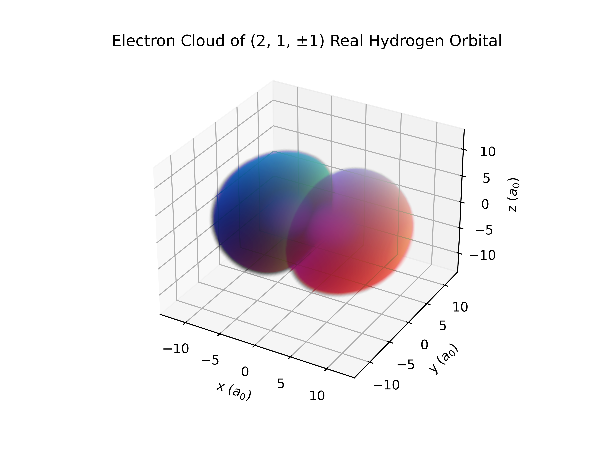

# Hydrogen Electron Orbital Renderer
High quality renders of electron orbitals around Hydrogen, as well as the software to generate them.
|  |  |  |
| ----- | ----- | ----- |
| Cross Section of a 5f Orbital | Probability Distribution of 5f Complex Orbital | Probability Distribution of a 5f Real Orbital |

## About
*note: the following is just a summary. I highly recommend reading [this Wikipedia article](https://en.wikipedia.org/wiki/Wave_function#Hydrogen_atom), and [this LibreTexts article](https://chem.libretexts.org/Bookshelves/Physical_and_Theoretical_Chemistry_Textbook_Maps/Map%3A_Physical_Chemistry_for_the_Biosciences_(Chang)/11%3A_Quantum_Mechanics_and_Atomic_Structure/11.10%3A_The_Schrodinger_Wave_Equation_for_the_Hydrogen_Atom). A large amount of the following explanation uses both of these articles as a source. Additionally, [this explanation](https://physics.stackexchange.com/q/190730) on stack exchange on the difference between real and complex orbitals was extremely useful.*

This repository contains all 3d and cross-sectional renders for the probability density functions ($|\psi^2|$) of both real and complex orbitals.

Classical models of the atom, such as Bohr's model, model electrons as particles with definitive positions and momenta. This model does not account for various observed phenomena (see [Double-slit Experiment](https://en.wikipedia.org/wiki/Double-slit_experiment)). In reality, it is observed that particles, such as electrons, exhibit both particle and wave behavior.

In the quantum model of an atom, electron's do not exist in definite positions, but rather are described by their wave functions (denoted $\psi$), thus, the position of an electron is not definitive. According to the [Born interpretation](https://en.wikipedia.org/wiki/Born_rule), the value of the probability distribution function describing the chance of an electron being found at any given position, can be calculated by taking the amplitude of the wave function, and then squaring it ($|\psi^2|$).

The wave function for an electron around a hydrogen nucleus (single proton), is defined in spherical coordinates as follows:
$$\psi_{n,l,m}(r,\theta,\phi)=R_{n,l}(r)Y_{l,m}(\theta,\phi)$$

Where
- $n =$ The principal quantum number, refers to the energy level of the electron, $0 < n$
- $l =$ The azimuthal quantum number, refers to the subshell of the electron, $0 \le l \le n - 1$
- $m =$ The magnetic quantum number, refers to the specific orbital within the subshell, $-l \le m \le l$
- $Y_{l,m}(\theta,\phi) =$ spherical harmonics of l, order m (provided by Scipy's `scipy.special.sph_harm`)
- $R_{n,l}(r) =$ the radial function (provided by [Prof. Davit Potoyan and Mr. Zachery Crandall](https://dpotoyan.github.io/Chem324/H-atom-wavef.html))

Note: in chemistry class, you may have learned that subshells are labeled s, p, d, f, g, h, and i. These refer to the azimuthal quantum numbers ($`l`$) 0, 1, 2, 3, 4, 5, and 6 respectively.

The diagrams generated from this project are titled with the three numbers characterizing electrons, (n, l, m). While the software can generate diagrams for negative ms, and hypothetically for unlimited energy levels (or the python factorial limit), graphs are only generated for positive ms, as the magnitude of the wave function, and thus probability distribution function, is the same for $\pm m$.

This wave function is most often used in physics, and is always rotationally symmetrical around the z-axis. With that being said, the most common visual of an electron orbital is its real orbital. This is likely the orbital you've seen in a highschool textbook. Real orbital wave functions are superpositions of the two complex orbital wave functions, $\psi_{n,l,m}(r,\theta,\phi)$ and $\psi_{n,l,-m}(r,\theta,\phi)$. Since both of these are complex conjugates of each other, the resulting wave function is real-valued. The real orbital wave function can be computed as follows,

$$\psi^{real}\_{n,l,m}(r,\theta,\phi)=
  \begin{cases}
    \sqrt{2}(-1)^{m}Im(\psi\_{n,l,|m|}(r,\theta,\phi)) & \text{if } m < 0\\
    \psi\_{n,l,|m|}(r,\theta,\phi) & \text{if } m = 0 \\
    \sqrt{2}(-1)^{m}Re(\psi\_{n,l,|m|}(r,\theta,\phi)) & \text{if } m > 0
  \end{cases}
$$

|  |  |
| ----- | ----- |
| Complex 2p Orbital for $m=1$| Real 2p Orbital for $m=1$|

Rendering the probability distribution function, is done by sampling and even distribution of points in cartesian space, converting the cartesian coordinates to spherical coordinates, and computing $|\psi^2|$ at that point. This is done either in a two dimensional grid for the cross section diagrams, or in a 3d grid for the 3d diagrams. The cross section diagrams are sampled in a $400 \times 400$ grid (160,000 data points total), and the 3d diagrams are sampled in a $100 \times 100 \times 100$ grid (1,000,000 data points total).

## Navigating the Images
The `/img` directory contains all rendered images. They are split into the self-explanatory subdirectories `3d-complex`, `3d-real`, and `cross`. Under each directory, images are titled `n_l_m.png`.

## Navigating the Rendering Software
All rendering software is under `/generator` directory.
- `generator/render_3d.py` and `generator/render_cross_section.py` contain methods to render their respective orbitals.
- `generator/hydrogen.py` contains methods for computing the probability density functions of real and complex orbitals, in both cartesian and spherical coordinates. Credit to [Prof. Davit Potoyan and Mr. Zachery Crandall](https://dpotoyan.github.io/Chem324/H-atom-wavef.html) for the radial function.
- `generator/get_render_radius.py` contains an algorithm for finding what bounding radius should be rendered.

## Render Your Own Orbitals
The software used to generate these renders was built with Python, Scipy, Numpy, and Matplotlib. To install all necessary packages through pip,
``` python
pip install -r requirements.txt
```

From there, run `python3 generator/main.py` to generate renders for all 140 orbitals.

## Credits
- Built by [Liam Ilan](https://github.com/liam-ilan)
- Credit to [Prof. Davit Potoyan and Mr. Zachery Crandall](https://dpotoyan.github.io/Chem324/H-atom-wavef.html) for the radial function
