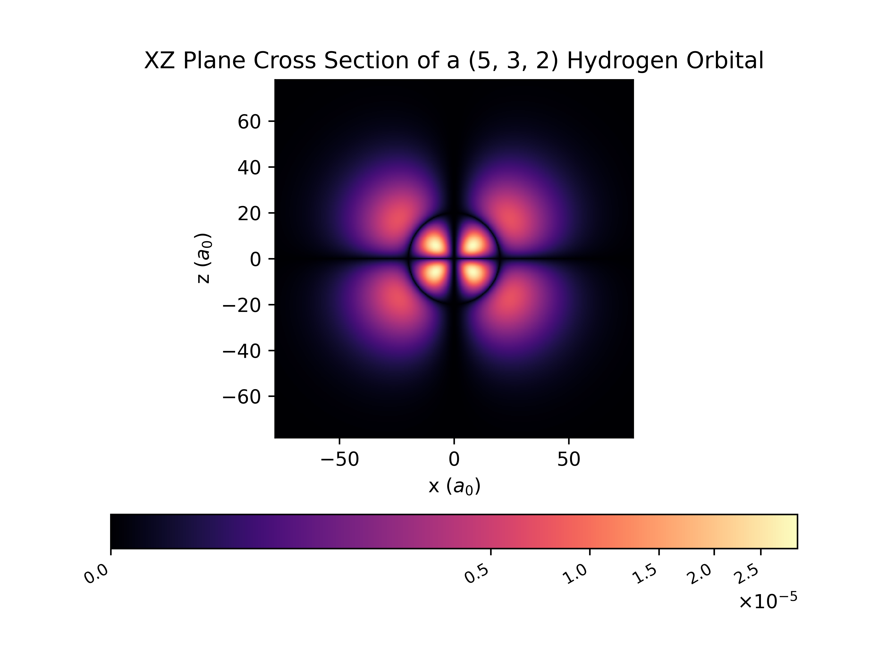
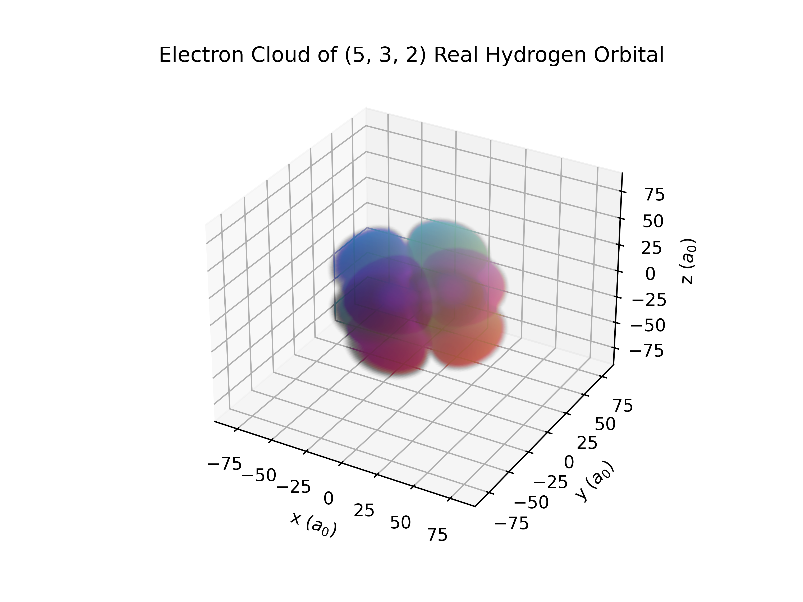

# Hydrogen Electron Orbital Renderer
High quality renders of electron orbitals around Hydrogen, as well as the software to generate them.
|  |  |  |
| ----- | ----- | ----- |
| Cross Section of a 5f Orbital | Probability Distribution of 5f Complex Orbital | Probability Distribution of a 5f Real Orbital |

## About
*note: the following is not from a professional. I highly recommend reading [this Wikipedia article](https://en.wikipedia.org/wiki/Wave_function#Hydrogen_atom), and [this LibreTexts article](https://chem.libretexts.org/Bookshelves/Physical_and_Theoretical_Chemistry_Textbook_Maps/Map%3A_Physical_Chemistry_for_the_Biosciences_(Chang)/11%3A_Quantum_Mechanics_and_Atomic_Structure/11.10%3A_The_Schrodinger_Wave_Equation_for_the_Hydrogen_Atom). A large amount of the following explanation uses both of these articles as a source. Additionally, [this explanation](https://physics.stackexchange.com/q/190730) on stack exchange on the difference between real and complex orbitals was extremely useful.*

This repository contains all 3d and cross-sectional renders for the probability density functions ($|\psi^2|$) of both real and complex orbitals.

Classical models of the atom, such as Bohr's model, model electrons as particles with definitive positions and momenta. This model does not account for various observed phenomena (see [Double-slit Experiment](https://en.wikipedia.org/wiki/Double-slit_experiment)). In reality, it is observed that particles, such as electrons, exhibit both particle and wave behavior.

In the quantum model of an atom, electron's do not exist in definite positions, but rather are described by their wave functions (denoted $\psi$), thus, the position of an electron is not definitve. According to the [Born interpretation](https://en.wikipedia.org/wiki/Born_rule), the value of the probability distribution function describing the chance of an electron being found at any given position, can be calculated by taking the amplitude of the wave function, and then squaring it ($|\psi^2|$).

The wave function for an electron around a hydrogen nucleus (single proton), is defined in spherical coordinates as follows:
$$\psi_{n,l,m}(r,\theta,\phi)=R_{n,l}(r)Y_{l,m}(\theta,\phi)$$

Where
- $n =$ The principle quantum number, $0 < n$
- $l =$ The azimuthal quantum number, $0 \le l \le n - 1$
- $m =$ The magnetic quantum number, $-l \le m \le l$
- $Y_{l,m}(\theta,\phi) =$ spherical harmonics of l, order m (provided by scipy's `scipy.special.sph_harm`)
- $R_{n,l}(r) =$ the radial function (provided by [Prof. Davit Potoyan and Mr. Zachery Crandall](https://dpotoyan.github.io/Chem324/H-atom-wavef.html))

This wave function is most often used in physics, and are always rotationally symetrical around the z-axis. With that being said, the most common visual of an electron orbital is it's real orbital. Real orbital wave functions are superpositions of the two complex orbital wave functions, $\psi_{n,l,m}(r,\theta,\phi)$ and $\psi_{n,l,-m}(r,\theta,\phi)$. Since $\psi_{n,l,-m}(r,\theta,\phi)$ is the complex conjugate of $\psi_{n,l,m}(r,\theta,\phi)$, the resulting wave function is real-valued.

$\psi^{\text{real}}_{n,l,m}(r,\theta,\phi)=\sqrt{2}(-1)^{m}Im(\psi_{n,l,|m|}(r,\theta,\phi))\psi_{n,l,|m|}(r,\theta,\phi)\sqrt{2}(-1)^{m}Re(\psi_{n,l,|m|}(r,\theta,\phi))$


Rendering the probability distribution function, is done by sampling and even distribution of points in cartesian space, converting the cartesian coordinates to spherical coordinates, and computing the wave function at that point. This is done either in a two dimensional grid for the cross section diagrams, or in a 3d grid for the 3d diagrams. The cross section diagrams are sampled in a $400 \times 400$ grid (160,000 datapoints total), and the 3d diagrams are sampled in a $100 \times 100 \times 100$ grid (1,000,000 datapoints total).

## Render Your Own Orbitals
The software used to generate these renders was built with Python, Scipy, Numpy, and Matplotlib. To install all necessary packages through pip,
``` python
pip install -r requirements.txt
```

From there, run `python3 generator/main.py` to generate renders for all 140 orbitals.

### Notes for modifying the software
- `generator/render_3d.py` and `generator/render_cross_section.py` contain methods to render their respective orbtials.
- `generator/hydrogen.py` contains methods for computing the probability density functions of real and complex orbitals, in both cartesian and spherical coordinates. Credit to [Prof. Davit Potoyan and Mr. Zachery Crandall](https://dpotoyan.github.io/Chem324/H-atom-wavef.html) for the radial function.
- `generator/get_render_radius.py` contains an algorithim for finding what bounding radius should be rendered